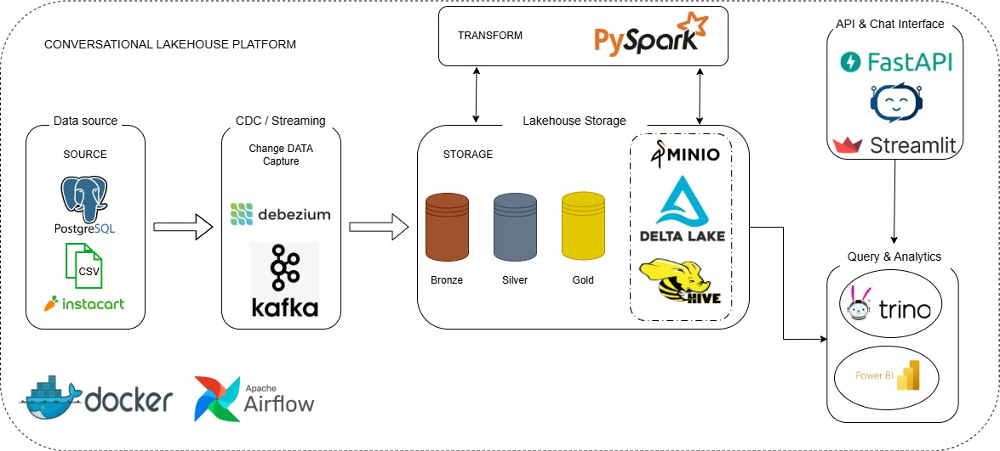

# Conversational Lakehouse Platform

> Modern end-to-end lakehouse project for streaming data ingestion, Delta Lake storage, SQL analytics, and conversational data access.

## Project Snapshot

- **Source Data:** PostgreSQL + CSV dataset  
- **CDC & Streaming:** Debezium + Kafka  
- **Processing:** PySpark  
- **Lakehouse Storage:** MinIO + Delta Lake + Hive Metastore  
- **Query Layer:** Trino  
- **Analytics & Interface:** Power BI + FastAPI + Streamlit  
- **Infrastructure:** Docker + Airflow

## What I Built

- Loaded transactional sample data into **PostgreSQL**
- Captured source changes with **Debezium** and **Kafka**
- Processed streaming data with **PySpark**
- Organized data into **Bronze**, **Silver**, and **Gold** layers
- Exposed analytics-ready data through **Trino**
- Designed the platform for **BI dashboards** and **chat-based analytics**

## Architecture

## Pipeline Flow

| Stage | Purpose |
|---|---|
| **Source** | PostgreSQL and CSV input data |
| **CDC / Streaming** | Capture data changes with Debezium and Kafka |
| **Bronze** | Land raw data in the lakehouse |
| **Silver** | Clean and organize data |
| **Gold** | Prepare analytics-ready tables |
| **Consume** | Query with Trino and analyze in Power BI |
| **Conversational Layer** | Explore data with FastAPI and Streamlit |

## Tech Stack

`Docker` `Airflow` `PostgreSQL` `Debezium` `Kafka` `PySpark` `MinIO` `Delta Lake` `Hive Metastore` `Trino` `FastAPI` `Streamlit` `Power BI`

## Repo Highlights

- `scripts/load_instacart.py` loads the sample dataset into PostgreSQL
- `infra/debezium/connectors/postgres-cdc.json` defines the CDC connector
- `spark/jobs/bronze/` contains PySpark streaming jobs for Delta ingestion
- `infra/trino/catalog/delta.properties` connects Trino to the lakehouse

## Why This Project

This project shows how I build a modern data platform that goes from **raw operational data** to **analytics-ready tables** and **user-friendly consumption layers**.